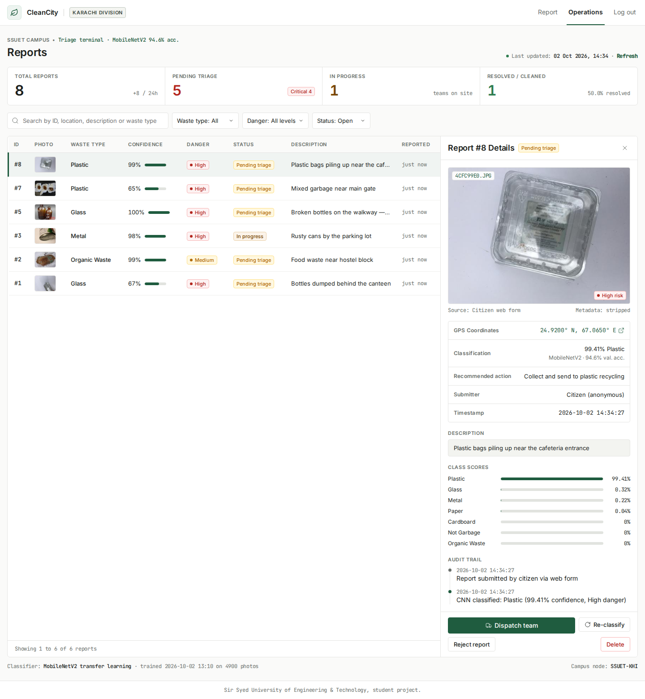
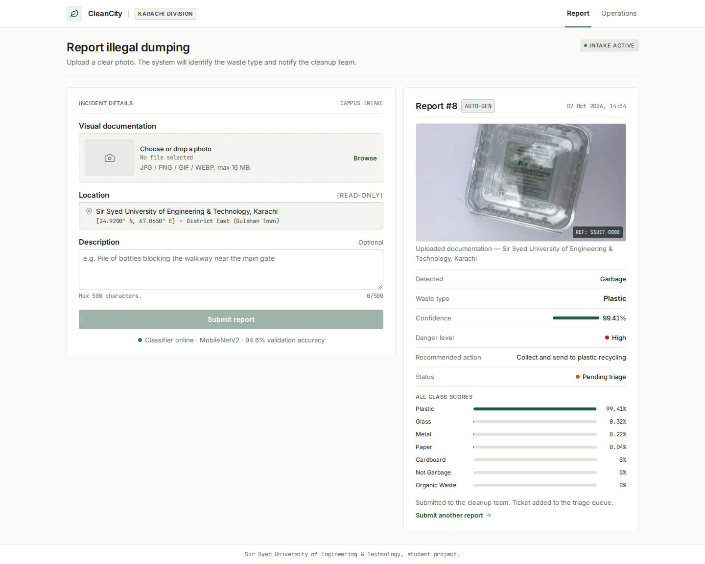
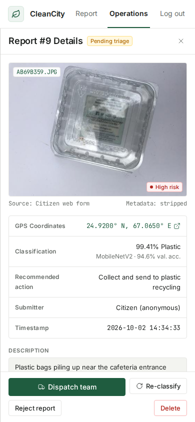
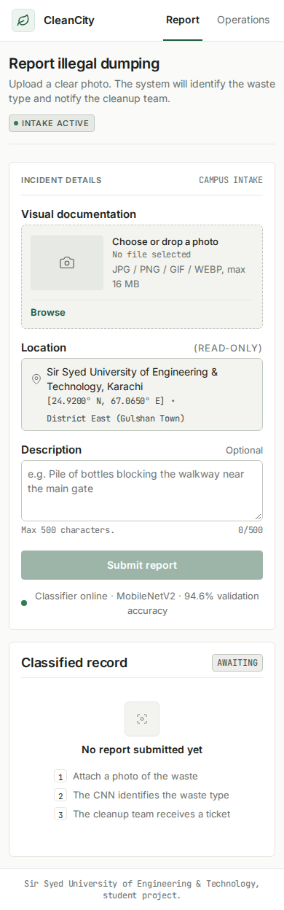
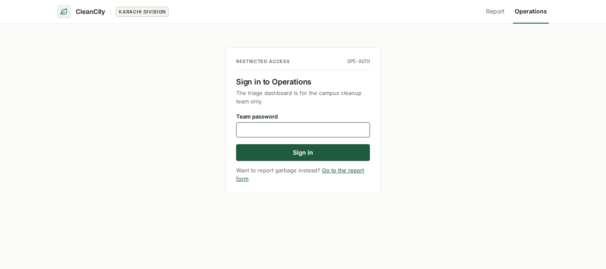

# CleanCity — CNN Garbage Detection & Cleanup Triage


**Live demo:** _add your Hugging Face Space link here_ (see [Deploy](#deploy-free-live-demo))

A web app for **Sir Syed University of Engineering & Technology, Karachi**. Anyone can photograph garbage on
campus; a **convolutional neural network (MobileNetV2, transfer learning)** identifies the type of waste, rates how
dangerous it is and recommends an action. The cleanup team triages every report from a password-protected
operations dashboard.



## Screenshots

| Report page | Mobile — report details |
|---|---|
|  |  |

| Mobile — report form | Team login |
|---|---|
|  |  |

## Features

**Report page** (`/`)
- Upload or drag & drop a photo (PNG / JPG / GIF / WEBP, max 16 MB)
- Classified-record panel: report number, photo, waste type, confidence, danger level, recommended action and the score for every class
- Flags uncertain predictions (confidence below 50%) for manual review

**Operations dashboard** (`/team`, password protected)
- Stats: total reports (+ last 24 h), pending triage (+ critical count), in progress, cleaned (+ resolution rate)
- Search, filter by waste type / danger / status, pagination
- Detail drawer: photo, GPS link, classification, class scores and a full **audit trail**
- Actions: **Dispatch team → Mark cleaned**, Reject, Reopen, **Re-classify** (re-runs the CNN), Delete

**Engineering**
- Trained CNN loaded once at startup; predictions serialized so concurrent requests are safe
- SQLite database (unique IDs, safe with many users at once) with an events table for the audit trail
- Uploaded photos are verified, resized and re-saved as JPEG (removes hidden GPS/EXIF metadata)
- CSRF protection on all team forms, HTTP-only session cookies, safe login redirects
- 21 automated tests, Docker image for deployment
- UI built from a custom design system ([`docs/design/`](docs/design/municipal_utility_interface/DESIGN.md)): Inter + JetBrains Mono, flat 1 px borders, status-colour chips — plain CSS and JavaScript, no build step

## How the CNN Works

```
Photo uploaded
      ↓
Fix rotation (EXIF), resize to 224×224, scale pixels to [-1, 1]
      ↓
MobileNetV2 (pre-trained on ImageNet) → 1280 visual features
      ↓
Our head: GlobalAveragePooling → Dense(128, ReLU) → Dropout(0.3) → Dense(7, Softmax)
      ↓
Cardboard · Glass · Metal · Organic Waste · Paper · Plastic · Not Garbage
      ↓
Confidence % + danger level + recommended action → shown to the citizen and the team
```

### Training — transfer learning in two phases
1. **Head training** — MobileNetV2 frozen, only the new layers learn (Adam, lr 1e-3, 6 epochs)
2. **Fine-tuning** — last 40 MobileNetV2 layers unfrozen, BatchNorm kept frozen (Adam, lr 1e-5, 6 epochs)

Data augmentation (flip, rotation, zoom, contrast), early stopping and balanced classes (≤ 900 photos each)
reduce overfitting. 80% of the photos are used for training and 20% are held back to measure accuracy;
the script checks that no photo appears in both sets.

### Results (1,225 held-out validation photos)

| Class | Accuracy | Danger | Recommended action |
|---|---|---|---|
| Plastic | 88.9% | High | Collect and send to plastic recycling |
| Glass | 88.9% | High | Handle carefully — use gloves; glass recycling |
| Metal | 94.9% | High | Use protective gear; scrap/metal recycling |
| Organic Waste | 97.1% | Medium | Compost or organic waste facility |
| Cardboard | 94.3% | Low | Send to recycling center |
| Paper | 96.4% | Low | Send to paper recycling |
| Not Garbage | 100.0% | None | No action needed |
| **Overall** | **94.6%** | | |

Full details including the confusion matrix are in [`model/model_info.json`](model/model_info.json).
The datasets mostly contain clear photos of single items, so accuracy on cluttered real-world scenes will be lower.

### Datasets
| Our class | Source |
|---|---|
| Cardboard, Glass, Metal, Paper, Plastic, Organic Waste | [Garbage Classification (12 classes)](https://huggingface.co/datasets/UdaraChamidu/Garbage-Classification-with-12-classes) — glass = brown + green + white glass, organic = biological |
| Not Garbage | [Intel Image Classification](https://huggingface.co/datasets/sfarrukhm/intel-image-classification) — buildings, street, forest, sea, mountain scenes |

## Try It with Sample Images

[`samples/`](samples/) has one example photo per class — upload any of them on the report page:

| File | Expected result |
|---|---|
| `samples/plastic.jpg` | Plastic |
| `samples/glass.jpg` | Glass |
| `samples/metal.jpg` | Metal |
| `samples/organic.jpg` | Organic Waste |
| `samples/cardboard.jpg` | Cardboard |
| `samples/paper.jpg` | Paper |
| `samples/not_garbage.jpg` | Not Garbage |

All seven are classified correctly with more than 99% confidence. `glass`, `organic`, `paper` and `not_garbage`
were never seen during training.

## Getting Started

**Requirements:** Python 3.11 (TensorFlow does not support every newer Python version yet).

```bash
git clone https://github.com/AbdullahMJamal/<repo-name>.git
cd <repo-name>

# create and activate a virtual environment
python -m venv .venv
.venv\Scripts\activate          # Windows (PowerShell: .venv\Scripts\Activate.ps1)
source .venv/bin/activate       # Linux / macOS / WSL

pip install -r requirements.txt   # TensorFlow is large — this can take a few minutes
python app.py
```

| Page | URL |
|---|---|
| Report page | http://127.0.0.1:5000/ |
| Operations dashboard | http://127.0.0.1:5000/team — default password **`cleancity`** |

### Configuration (environment variables)

| Variable | Purpose | Default |
|---|---|---|
| `TEAM_PASSWORD` | Password for the operations dashboard | `cleancity` |
| `SECRET_KEY` | Signs session cookies | random, saved in `instance/secret_key` |
| `FLASK_DEBUG` | `1` enables debug mode (local development only) | off |

```bash
export TEAM_PASSWORD="your-password"     # Linux / macOS / WSL
$env:TEAM_PASSWORD="your-password"       # Windows PowerShell
```

### Run the tests
```bash
python -m pytest
```

### Retrain the model (optional)
The trained model is included. To train it again, download the two datasets above, then:
```bash
python scripts/prepare_dataset.py --garbage-dir <12-class folder> --clean-dir <clean scenes folder> --out dataset
python train.py --data-dir dataset
```
Training takes about 40 minutes on a laptop CPU. Afterwards, use **Re-classify** on the dashboard to update old reports.

## Deploy (free live demo)

The repo includes a `Dockerfile` and the Hugging Face configuration at the top of this README, so it runs on
**[Hugging Face Spaces](https://huggingface.co/spaces)** for free (16 GB RAM — enough for TensorFlow).

1. Create a Space at https://huggingface.co/new-space → **SDK: Docker** → **Blank** → Public.
2. In the Space: **Settings → Variables and secrets → New secret** → `TEAM_PASSWORD` = your password.
3. Upload the project with the Hugging Face CLI (it handles the large model file automatically):
   ```bash
   pip install -U huggingface_hub
   hf auth login        # paste an access token with "write" permission (huggingface.co/settings/tokens)
   hf upload <hf-username>/cleancity . . --repo-type space \
     --exclude "env/*" --exclude ".git/*" --exclude ".idea/*" --exclude "instance/*" \
     --exclude "static/uploads/*" --exclude "**/__pycache__/*" --exclude ".venv*/*"
   ```
4. Wait for the build (~5 min). Your app is live at `https://<hf-username>-cleancity.hf.space` — put that link at the top of this README.

> On the free tier the Space sleeps when unused and its storage resets on restart, so demo reports are temporary.

The same `Dockerfile` works on any Docker host: `docker build -t cleancity . && docker run -p 7860:7860 cleancity`.

### Hosting options compared

| Host | Works? | Notes |
|---|---|---|
| **Hugging Face Spaces** | ✅ Recommended | Free, 16 GB RAM, Docker support, built for ML demos |
| Google Cloud Run | ✅ | Uses the Dockerfile; generous free tier but needs a billing account; set memory to 2 GB |
| Railway | ✅ | Uses the Dockerfile; small monthly cost |
| Render (free) / Koyeb (free) | ❌ | 512 MB RAM is not enough for TensorFlow + the model |
| Vercel / Next.js hosting | ❌ | Serverless functions are too small for TensorFlow (~250 MB limit) and have no permanent disk for the SQLite database |
| GitHub Pages / Netlify | ❌ | Static sites only — cannot run Python |

## Troubleshooting

| Problem | Fix |
|---|---|
| `error: externally-managed-environment` when running `pip install` (Ubuntu / WSL) | Don't install into the system Python — create a virtual environment first (`python3 -m venv .venv && source .venv/bin/activate`), then `pip install -r requirements.txt`. Never use `--break-system-packages`. |
| `running scripts is disabled on this system` (Windows PowerShell) | Run `Set-ExecutionPolicy -Scope CurrentUser RemoteSigned` once, then activate again. |
| `No matching distribution found for tensorflow` | Your Python version is too new or too old. Use **Python 3.11** (`py -3.11 -m venv .venv` on Windows). |
| Windows venv (`env\Scripts\...`) doesn't work in WSL / Linux | A virtual environment only works on the OS that created it. Create a separate one in WSL. |
| Page says "AI model is not loaded" | `model/garbage_model.keras` is missing or TensorFlow is not installed. Run `pip install -r requirements.txt`; if the model file is missing, see [Retrain the model](#retrain-the-model-optional). |
| Dashboard keeps asking for the password | Use the value of `TEAM_PASSWORD` (default `cleancity`). The variable must be set in the **same terminal** before `python app.py`. |
| `Address already in use` / port 5000 busy | Another copy is running — stop it with **Ctrl + C**, or close the other terminal. |
| First start is slow (10–20 s) | Normal — TensorFlow loads the model once at startup. |
| Old reports show outdated AI results after retraining | Open the report on the dashboard and click **Re-classify**. |
| "Invalid or expired form" after leaving the dashboard open | Your session expired — reload the page and try again. |

## Project Structure

```
├── app.py                     ← Flask app: routes, security, upload handling
├── database.py                ← SQLite storage: reports + audit trail
├── train.py                   ← Trains the CNN and saves it
├── model/
│   ├── garbage_classifier.py  ← CNN architecture, loading, prediction
│   ├── garbage_model.keras    ← Trained model
│   └── model_info.json        ← Accuracy, per-class results, confusion matrix
├── scripts/prepare_dataset.py ← Builds the training dataset from the public datasets
├── templates/                 ← base / user / team / login pages (Jinja2)
├── static/
│   ├── img/leaf.svg           ← Logo
│   └── uploads/               ← Photos submitted by users (not in git)
├── samples/                   ← Example photos, one per class
├── tests/test_app.py          ← 21 automated tests
├── docs/
│   ├── design/                ← UI design system and mockups
│   └── screenshots/           ← Screenshots used in this README
├── Dockerfile                 ← Production image (gunicorn)
└── requirements.txt
```

## Tech Stack

| Layer | Technology |
|---|---|
| Machine learning | TensorFlow / Keras, MobileNetV2 transfer learning |
| Backend | Python, Flask, SQLite, Pillow |
| Frontend | HTML, CSS, JavaScript (no frameworks), Jinja2 |
| Testing | pytest |
| Deployment | Docker, gunicorn, Hugging Face Spaces |

---

Student project — Sir Syed University of Engineering & Technology, Karachi.
# cleancity-cnn-garbage-detection
